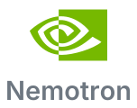
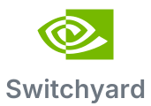
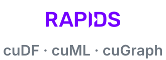
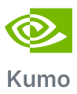
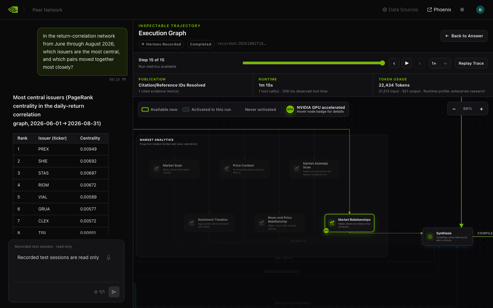
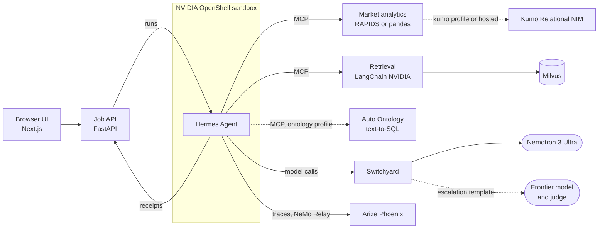

# Enterprise Research: market analysis agent

<p align="center">
  <a href="https://hermes-agent.nousresearch.com"></a>&nbsp;&nbsp;
  <a href="https://github.com/NVIDIA/OpenShell"></a>&nbsp;&nbsp;
  <a href="https://developer.nvidia.com/nemotron"></a>&nbsp;&nbsp;
  <a href="https://github.com/NVIDIA-NeMo/Switchyard"></a>&nbsp;&nbsp;
  <a href="https://rapids.ai"></a>&nbsp;&nbsp;
  <a href="https://kumo.ai"></a>&nbsp;&nbsp;
  <a href="tools/auto-ontology/README.md"></a>&nbsp;&nbsp;
  <a href="https://github.com/langchain-ai/langchain-nvidia"></a>&nbsp;&nbsp;
  <a href="https://milvus.io"></a>&nbsp;&nbsp;
  <a href="https://phoenix.arize.com"></a>
</p>

<p align="center">
  
</p>

You ask a question about a market. A Hermes agent in an OpenShell sandbox plans the work and calls tools: market
analytics on RAPIDS cuDF, cuML and cuGraph (pandas on a CPU), Kumo predictions, text-to-SQL with Auto Ontology,
and retrieval over SEC filings and regulations with Nemotron embedding and reranking. Every model call goes
through Switchyard, which serves Nemotron 3 Ultra and can hand a session to a frontier model when a judge model
asks for one. The answer cites the tool calls behind it, and each citation opens the data that call returned. The
UI draws the run as a live graph of every model and tool call, links its trace in Phoenix, and replays recorded
runs without keys or a GPU.

## Run it

You need Docker Engine 28+ with Compose 2.30+ (Linux with kernel 6.2+, or macOS with colima), bash, curl and an
`nvapi-` key from [build.nvidia.com](https://build.nvidia.com). OpenShell 0.1.2 runs in containers that
`demo.sh` pins and builds, so there is no CLI to install. An NVIDIA GPU is optional (RAPIDS and the Kumo NIM),
and the Auto Ontology questions need access to its submodule while `NVIDIA/auto-ontology` is private.

```bash
git clone https://github.com/pastorsj/market-analysis-claw-demo.git
cd market-analysis-claw-demo
git submodule update --init --checkout vendor/auto-ontology   # optional, needs access
./scripts/demo.sh init    # creates .env and its internal secrets
"${EDITOR:-vi}" .env      # set INFERENCE_API_KEY and SEC_USER_AGENT
./scripts/demo.sh up      # builds, prepares the data, starts everything
./scripts/demo.sh check   # proves the sandbox boundary
```

In `.env`, `INFERENCE_API_KEY` is your `nvapi-` key and `SEC_USER_AGENT` a name and an email for SEC EDGAR
(`Jane Doe jane@example.com`); with the submodule, also add `ontology` to `COMPOSE_PROFILES`. Then open
<http://127.0.0.1:3100> and pick a question. `./scripts/demo.sh replay` serves the recorded sessions alone, with
no keys or GPU.

The default data pack, `synthetic-market`, is a fictional market that builds with nothing to fetch.
`us-equities` holds real prices that stay outside the repository; `./scripts/demo.sh data fetch` brings them in
([data packs](docs/data-packs.md#the-packs)). [Configuration](docs/configuration.md) covers models, profiles and
hardware, and [operations](docs/operations.md) everything after `up`.

## Architecture



## Documentation

- [Architecture](docs/architecture.md): components, request flow, contracts, trust boundaries, limitations, technologies
- [Configuration](docs/configuration.md): every `.env` variable, profiles, hardware tiers, `doctor`
- [Operations](docs/operations.md): lifecycle, Phoenix, jobs, recording and replay, on-demand checks, troubleshooting
- [Models and routing](docs/models-and-routing.md): endpoints, model ids, routing templates, the bake-offs
- [OpenShell](docs/openshell.md): the sandbox image, its policy, providers and lifecycle
- [Retrieval](docs/retrieval.md): the document pipeline and its configuration
- [Data packs](docs/data-packs.md): the pack contract, recordings, adding a pack
- [Data platform](docs/data-platform.md): external data, fetch, import, the Data Designer pack, the questions
- [Customize](docs/customize.md): adding a tool, a server, a skill or a model
- [Development](docs/development.md): project structure, tests, CI
- [Decisions](docs/decisions.md): the decision log and its workarounds
- Data packs: [synthetic-market](data/packs/synthetic-market/README.md), [us-equities](data/packs/us-equities/README.md)
- Components: [API](api/README.md), [UI](ui/README.md), [retrieval](tools/retrieval/README.md),
  [market analytics](tools/market-analytics/README.md), [Auto Ontology](tools/auto-ontology/README.md)

## License

Apache-2.0 ([LICENSE](LICENSE)). The UI is derived from the [AI-Q blueprint UI](https://github.com/NVIDIA-AI-Blueprints/aiq);
[`ui/UPSTREAM.md`](ui/UPSTREAM.md) records the changes.
