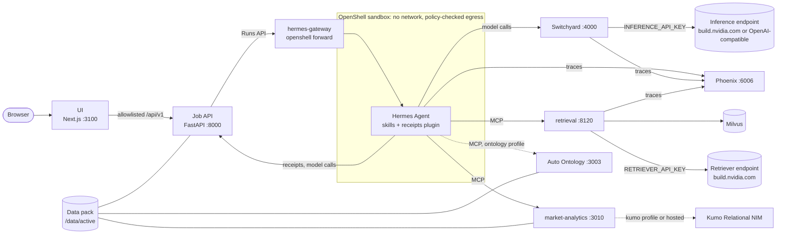

# Market analysis claw demo

A research agent that answers market questions with cited evidence and shows its work. Ask about a market
(which assets led, which sessions were unusual, what a regulation requires, what a model predicts) and the
agent calls analytics, retrieval and prediction tools, writes a report in which every claim cites the tool
result behind it, and hands you the full run: a graph of every model and tool call, the evidence each citation
points to, and the trace in Phoenix.

- **Sandboxed agent.** [Hermes Agent](https://github.com/NousResearch/hermes-agent) runs inside an
  [NVIDIA OpenShell](https://github.com/NVIDIA/OpenShell) sandbox with no network interface. It reaches only
  the routes and MCP tools its policy allows, and it never sees a model key.
- **Routed models.** [Switchyard](https://github.com/NVIDIA-NeMo/Switchyard) serves every model call. It can
  pin a model or escalate a session from an efficient model to a capable one; a measured bake-off informed the
  default.
- **NVIDIA retrieval and GPU analytics.** Nemotron embed and rerank models over Milvus find cited passages in
  SEC filings and the eCFR. The market tools run on pandas or, with the same code, on RAPIDS. Kumo Relational
  predicts outcomes, and NVIDIA Auto Ontology answers structured questions with SQL.
- **Evidence you can inspect.** Every tool call becomes a typed receipt, every citation opens its receipt, and
  recorded sessions replay without keys or a GPU.

## Architecture



Every port is published on 127.0.0.1 only (`UI_BIND_HOST` can open the UI's alone to a trusted proxy, such as
a Brev secure link: [operations](docs/operations.md#brev-vm-mode)). The sandbox reaches the services as `host.openshell.internal`,
which the host-networked OpenShell supervisor maps to the host's loopback. The browser talks only to the UI,
which proxies an allowlisted set of API routes. [Architecture](docs/architecture.md) describes the components,
the request flow, the contracts and the trust boundaries.

## Technologies

| Layer | Technology | Version |
|---|---|---|
| Agent | Hermes Agent | 0.21.5 (image `nousresearch/hermes-agent:v2026.9.24`) |
| Sandbox | NVIDIA OpenShell (gateway, supervisor, sandbox, CLI) | 0.1.2 |
| Model router | NVIDIA Switchyard (`switchyard-server`) | 0.3.0 |
| Models (default, build.nvidia.com) | Nemotron 3 Ultra 550B-A55B on every turn; Nemotron 3 Super 120B-A12B for auxiliary calls | hosted |
| Models (optional escalation) | Nemotron 3 Ultra escalating to GPT-6 Sol from any OpenAI-compatible provider, judged by Nemotron 3 Super | hosted |
| Retrieval models | Nemotron 3 Embed 1B, Llama Nemotron Rerank VL 1B v2 | hosted |
| Retrieval | `langchain-nvidia-ai-endpoints`, `pymilvus`, Milvus (CPU standalone) | 1.4.3, 2.6.17, 2.6.25 |
| Market analytics | pandas, scikit-learn, NetworkX; on GPU, RAPIDS cuDF, cuML and nx-cugraph | 2.3, 1.9, 3.6; 26.06 (CUDA 12) |
| Prediction | Kumo Relational NIM, `kumo-relational-client` | 1.0.1, 1.0.2 |
| Structured questions (optional) | NVIDIA Auto Ontology | 1.0.0 |
| Tool protocol | Model Context Protocol, Python SDK over streamable HTTP | `mcp` 2.2 |
| Tracing | NeMo Relay (bundled with Hermes), Arize Phoenix | Relay < 0.9, Phoenix 20.16.0 |
| Job API | Python, FastAPI, uvicorn, Pydantic, SQLite, DuckDB | 3.12, 0.141, 0.54, 2.13, –, 1.5.5 |
| UI | Next.js, React, NVIDIA KUI, React Flow (`@xyflow/react`), Zustand, Tailwind CSS | 16.3.6, 18.3, 0.600, 12.12.0, 5, 4 |
| Platform | Docker Engine, Docker Compose, uv, Node.js | 28+, 2.30+, 0.12, 22 |

## Hardware

| Tier | Profiles | Needs |
|---|---|---|
| Replay | `replay` | Any Docker host. No keys, no GPU |
| CPU (default) | `core,retrieval,analytics` | Docker Engine 28+ on a Linux 6.2+ kernel (OpenShell needs Landlock), at least 8 GiB of memory for Docker, x86_64 or arm64. Linux, or macOS with colima |
| GPU | `core,retrieval,analytics-gpu,kumo` | Linux x86_64, an NVIDIA GPU (driver 535+), the NVIDIA Container Toolkit, the Kumo NIM image from `nvcr.io`, and 150 GB of free disk (200 GB to rebuild images on the host). Tested on a 40 GB A100, where the stack held 4.3 GiB of GPU memory once Kumo had predicted, and 9.3 GiB of RAM. For example a Brev A100 VM ([Brev VM mode](docs/operations.md#brev-vm-mode)) |

The models are always hosted; no tier serves a model locally. Add the `ontology` profile to a live tier if you
have access to Auto Ontology. Details: [configuration](docs/configuration.md#hardware-tiers).

## Quickstart

You need Docker (Engine 28+ with Compose 2.30+), bash and curl, plus an `nvapi-` key from
[build.nvidia.com](https://build.nvidia.com). The one key serves both the models and the retriever.

The demo lands on `main` once [PR #1](https://github.com/pastorsj/market-analysis-claw-demo/pull/1) merges.
Until then, add `--branch feat/initial-demo` to the clone.

```bash
git clone https://github.com/pastorsj/market-analysis-claw-demo.git
cd market-analysis-claw-demo
./scripts/demo.sh init            # creates .env (mode 600) and generates the internal secrets
"${EDITOR:-vi}" .env              # INFERENCE_API_KEY (your nvapi- key), SEC_USER_AGENT
./scripts/demo.sh doctor --keys   # checks the host, .env, and that each endpoint lists your models
./scripts/demo.sh up              # builds, prepares the data, starts everything
./scripts/demo.sh check           # proves the sandbox boundary
```

Open <http://127.0.0.1:3100>, pick a featured question, and select **View Execution** on the answer. Phoenix
is at <http://127.0.0.1:6006>.

The first `up` builds every image, downloads about 1.4 GB of SEC EDGAR filings and embeds them, so it takes a
while (about 45 minutes with every profile on a Brev A100); later runs reuse all of it. `.env.example` defaults to build.nvidia.com, with
Nemotron 3 Ultra answering every turn. To escalate to GPT-6 Sol from another OpenAI-compatible provider, or to
use a different endpoint for every model, see [configuration](docs/configuration.md#1-inference-endpoint).

### Replay, with no keys

```bash
./scripts/demo.sh replay
```

This serves the UI alone on the sessions recorded with the data pack, at <http://127.0.0.1:3100>: the answers,
their evidence and the execution graphs, with no `.env`, keys, API or GPU. `./scripts/demo.sh up` returns to
live mode.

## Example questions

The featured questions (shortened here) are on the landing page and in the replay bundle.

| Question | Tool | Runs with |
|---|---|---|
| Which assets had the strongest and weakest adjusted returns over the 20 trading sessions ending August 31, 2026, and how did their daily volatility compare? | `market_scan` | featured |
| With January 2 to June 30, 2026 as the baseline, which 10 asset sessions in July and August were most unusual, and which features made them so? | `market_anomaly_scan` | featured |
| What does Title 17 of the eCFR require public companies to disclose about material cybersecurity incidents and cybersecurity risk management, strategy, and governance? | `retrieve_evidence` | featured |
| What did Galena Semiconductor say about export-license exposure, and which mitigations did it mention? | `retrieve_evidence` over the fictional briefs | featured |
| Across the 2,000-issuer qualification universe, which assets had the strongest and weakest adjusted returns from January 2, 2024 through August 31, 2026? | `market_scan` | featured |
| For each synthetic market event published from August 18 through August 28, 2026, what was the asset's return on the publication session and over the next two sessions? | `ask_question` | featured; needs the ontology profile |
| At the August 24, 2026 market-close anchor, rank the reviewed assets by likelihood of a positive return over the next five trading sessions. | `predict_asset_outcomes` | the kumo profile or a hosted Kumo endpoint |
| Which assets are most central in the June-through-August 2026 return-correlation network, and how do the leaders compare with unusual 20-session returns? | `analyze_market_relationships` | default |
| Compare second-quarter 2026 issuer disclosures about cybersecurity incidents with the current Title 17 requirements. | `retrieve_evidence` over both corpora | default |

The market is synthetic: twelve fictional issuers (plus 1,988 generated ones) with planted events, so answers
can be checked. The documents are real SEC filings and eCFR sections. All questions are in
[`data/packs/market-analysis/questions.yaml`](data/packs/market-analysis/questions.yaml).

## How it works

1. **Ask.** The UI submits the question and the selected sources as a job. The API runs one job at a time
   (four more may wait) on Hermes, through the Hermes Runs API.
2. **Plan.** Hermes follows its answer policy (`SOUL.md`): it splits the question into work items and loads a
   skill for each, only when a selected source grants that capability. Each run gets only its sources' tools.
3. **Call tools.** Model calls go to Switchyard, which picks the served model. Tool calls go to the MCP
   servers through the sandbox policy. The receipts plugin injects the job's source scope into each call and
   posts a typed receipt of the result to the API.
4. **Cite.** The report cites receipts as `[evidence:<id>]`. The API checks that every tool call has its
   receipt, turns the tokens into numbered citations with a Sources list, and stores the report.
5. **Show.** Every step becomes an `execution.v2` event. The UI streams them into an execution graph, a
   timeline and one explorer per tool call (passages, charts, SQL, predictions), and links the Phoenix trace.

## Customize

- **Models and routing:** edit `.env` and run `./scripts/demo.sh restart switchyard`.
  [Models and routing](docs/models-and-routing.md) has the templates and the bake-off behind the default.
- **Data:** add a data pack under `data/packs/`; no code changes while it meets the tools' contracts. See
  [data packs](docs/data-packs.md).
- **Tools and skills:** add an MCP tool, a server, a skill or a receipt kind; [customize](docs/customize.md)
  lists every file each one touches.
- **Profiles:** turn on GPU analytics, Kumo or Auto Ontology in `COMPOSE_PROFILES`; see
  [configuration](docs/configuration.md#profiles).

## Development

Each service is its own project: one `uv` project and lock per Python service (Python 3.12), and `npm` for the
UI.

```bash
./scripts/demo.sh test              # unit (every Python project, ruff, skills lint), ui, contracts, compose
./scripts/demo.sh test e2e          # UI build and Playwright: live smoke and replay of the recordings
./scripts/demo.sh test switchyard   # build Switchyard and dry-run every route template
uv run --directory api pytest       # one project: also agent, data and tools/*
npm --prefix ui run lint            # also type-check, test:ci, build and e2e
scripts/gen-contracts.sh --check    # the generated schemas and TypeScript are up to date
pre-commit run --all-files          # ruff, shellcheck, JSON/YAML/TOML checks, gitleaks
```

Tests run offline with no keys. Tests marked `live` call real endpoints and those marked `gpu` need a GPU, so
neither runs by default. CI
(`.github/workflows/ci.yml`) runs shellcheck, the Compose config of every profile set, every Python project,
the contracts check, the Switchyard dry-runs, and the UI's lint, type-check, unit tests, build and Playwright
suite.

When you change the code:

- Change the Pydantic models in `api/` or `contracts/tool-registry*.json`, then run
  `scripts/gen-contracts.sh`. Never edit `contracts/schemas/` or `ui/src/generated/`.
- Keep the wiring in sync: `agent/tests/test_wiring.py` fails when the registry, the agent config, the sandbox
  policy, the provider profiles and `compose.yaml` disagree about a tool or an endpoint.
- Services share JSON contracts only; never import another service's code.
- Publish ports on `127.0.0.1` only, and keep every Docker resource in the `market-demo` project.
- New files carry the SPDX header (`Copyright (c) 2026, NVIDIA CORPORATION & AFFILIATES`, `Apache-2.0`).
- Run the tests of every project you touch.

[`AGENTS.md`](AGENTS.md) is the same guide for coding agents.

## Project structure

```text
agent/                   Hermes profile, skills, receipts plugin, patches, sandbox policy and image
api/                     Job API (FastAPI): jobs, execution.v2 events, receipts, reports, recordings
ui/                      Next.js UI based on the upstream AI-Q UI; src/features/execution is the execution view
tools/retrieval/         retrieve_evidence: LangChain NVIDIA embed and rerank over Milvus
tools/market-analytics/  six market tools and Kumo prediction, on CPU or RAPIDS
tools/auto-ontology/     patches and seed for the optional Auto Ontology profile
infra/openshell/         OpenShell pins, gateway config, provider profiles, CLI image
infra/switchyard/        Switchyard image, route templates, judge prompt
infra/phoenix/           Phoenix launcher
data/                    data packs and the demo-data builder; packs/<id>/recordings is the replay bundle
contracts/               tool registry, JSON Schemas and golden fixtures
scripts/                 demo.sh lifecycle and gen-contracts.sh codegen
docs/                    the guides below
vendor/                  the private Auto Ontology submodule (not checked out by default)
```

## Documentation

| Guide | Covers |
|---|---|
| [Architecture](docs/architecture.md) | Components, request flow, contracts, trust boundaries |
| [Configuration](docs/configuration.md) | Every `.env` variable, profiles, hardware tiers, `doctor`, exit codes |
| [Models and routing](docs/models-and-routing.md) | Endpoints and model ids, routing templates, the bake-off and the recommendation |
| [OpenShell](docs/openshell.md) | The sandbox image, the policy, the providers, the lifecycle, known issues |
| [Retrieval](docs/retrieval.md) | The retrieval pipeline and its documented configuration items |
| [Data packs](docs/data-packs.md) | The pack contract, building, recording, adding a pack |
| [Customize](docs/customize.md) | Adding a tool, a server, a skill or a model |
| [Operations](docs/operations.md) | Lifecycle, Phoenix, jobs, troubleshooting, Brev VM mode |
| [Decisions](docs/decisions.md) | The decision log and the documented workarounds |

Each component also has its own README with its environment and tests.

## Limitations

- **Synthetic market data.** The issuers, prices, events and news are fictional and deterministic, generated
  for a software demonstration. Nothing here is investment advice.
- **Real documents, with their terms.** The SEC EDGAR filings fall under the SEC's reuse terms and may carry
  issuers' own rights, so they are downloaded at build time and never committed. The eCFR is United States
  government information, but not the official legal edition of the CFR.
- **Hosted models, with their terms.** Every model call goes to a hosted endpoint and is subject to that
  provider's terms. The default endpoint, build.nvidia.com, is open to anyone with an NVIDIA account but
  serves no GPT model; the escalation templates take GPT-6 Sol from a provider you configure.
- **Structured questions need Auto Ontology (the `ontology` profile); everything else runs without it.**
  Without the ontology profile, the agent declines questions that need exact rows, such as the per-event price
  reactions. The replay bundle was recorded with it.
- **Kumo.** The local Kumo NIM needs x86_64 and an NVIDIA GPU; elsewhere, use a hosted Kumo endpoint.
- **One user.** There are no accounts and no authentication, and one job runs at a time. The demo is for one
  person on one host.
- **Measured once.** The routing bake-off ran each question once (12 questions, 6 arms); its limits are in
  [models and routing](docs/models-and-routing.md#limits-of-this-bake-off).

## Security considerations

- **Loopback only.** Every port is published on `127.0.0.1`; on a remote host, use an SSH tunnel. Never
  publish Switchyard (no authentication), Phoenix (full trace payloads) or the Auto Ontology MCP server
  (trusted service mode). The UI has no sign-in and spends your inference credits: open it with
  `UI_BIND_HOST=0.0.0.0` only to a trusted proxy, such as a Brev secure link, and `doctor` warns while you do.
- **Keys.** `.env` holds the keys; it is created with mode 600 and is gitignored. Services get keys as Compose
  secret files; only Auto Ontology and an optional hosted Kumo key are read from the environment. Switchyard is
  the only holder of the model key on the agent path. `doctor` never prints a key, and replay needs none.
- **Sandbox.** Hermes runs in OpenShell with no network interface, Landlock filesystem rules and a
  per-endpoint policy (allowed MCP tool names and REST routes, for Hermes' interpreter only). No model key
  enters the sandbox, and the receipt key is an OpenShell placeholder that the supervisor replaces on three API
  routes only. `./scripts/demo.sh check` proves this on the running stack.
- **Untrusted content.** Retrieved documents can carry prompt injections. Each run gets only its sources'
  tools, the plugin injects the job's source scope, skills are read-only, there are no terminal, file or web
  tools, and the data viewer runs read-only, bounded SQL.
- **Recordings.** A recorded bundle holds questions, answers, evidence excerpts and model names. Review it
  before committing.

To report a security issue, use [NVIDIA's product security process](https://www.nvidia.com/en-us/security/)
rather than a public issue.

## License and acknowledgements

Apache-2.0; see [LICENSE](LICENSE). The UI is derived from the
[AI-Q blueprint UI](https://github.com/NVIDIA-AI-Blueprints/aiq) (Apache-2.0); [`ui/UPSTREAM.md`](ui/UPSTREAM.md)
records the base commit and every change.

Built with [Hermes Agent](https://github.com/NousResearch/hermes-agent),
[NVIDIA OpenShell](https://github.com/NVIDIA/OpenShell), [Switchyard](https://github.com/NVIDIA-NeMo/Switchyard),
NeMo Relay, [NVIDIA Nemotron](https://build.nvidia.com) models,
[LangChain NVIDIA AI Endpoints](https://github.com/langchain-ai/langchain-nvidia), [Milvus](https://milvus.io),
[RAPIDS](https://rapids.ai), [Kumo](https://kumo.ai) Relational, NVIDIA Auto Ontology, the
[Model Context Protocol](https://modelcontextprotocol.io), [Arize Phoenix](https://github.com/Arize-ai/phoenix),
[FastAPI](https://fastapi.tiangolo.com), [DuckDB](https://duckdb.org), [Next.js](https://nextjs.org),
NVIDIA KUI and [React Flow](https://reactflow.dev). Each keeps its own license, and each model its provider's
terms.
