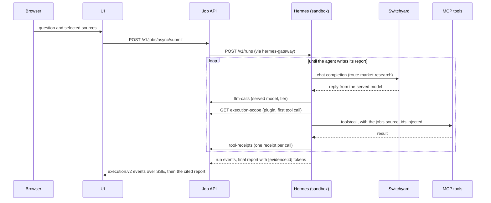

<!--
SPDX-FileCopyrightText: Copyright (c) 2026, NVIDIA CORPORATION & AFFILIATES. All rights reserved.
SPDX-License-Identifier: Apache-2.0
-->

# Architecture

One agent, a handful of tools, and a web UI that shows every step. Hermes Agent runs inside an OpenShell
sandbox. It answers a question by calling MCP tools over the active data pack, and it cites each tool result
it relies on. Every model call leaves the sandbox through Switchyard, which holds the model key and picks the
model. The job API records what happens as typed events and receipts, and the UI draws them as an execution
graph. Everything runs in one Docker Compose project, `market-demo`, driven by `scripts/demo.sh`.

## Components

| Service | Profile | Host port (127.0.0.1) | Role | Code |
|---|---|---|---|---|
| `ui` | core, replay | 3100 (`UI_PORT`) | Next.js web app; proxies an allowlisted `/api/v1/*` to the API; serves the replay bundle | [`ui/`](../ui/README.md) |
| `api` | core | 8000 | FastAPI job service: queue, Hermes runs, `execution.v2` events, receipts, reports, data viewer | [`api/`](../api/README.md) |
| `openshell` | core | 18080 (gRPC/mTLS), 18081 (health) | OpenShell gateway with the Docker compute driver; creates the Hermes sandbox | [`infra/openshell/`](../infra/openshell/README.md) |
| `hermes-gateway` | core | – | `openshell forward service`: the API's way in to Hermes on `127.0.0.1:8642` inside the sandbox | [`infra/openshell/`](../infra/openshell/README.md) |
| Hermes sandbox | – | – | Hermes Agent 0.21.5 with its profile, skills and receipts plugin; created by `demo.sh`, not by Compose | [`agent/`](../agent/README.md) |
| `switchyard` | core | 4000 | Model router; the only holder of `INFERENCE_API_KEY` on the agent path | [`infra/switchyard/`](../infra/switchyard/README.md) |
| `phoenix` | core | 6006 | Arize Phoenix: trace UI and OTLP/HTTP collector | [`infra/phoenix/serve.py`](../infra/phoenix/serve.py) |
| `data` (one-shot) | core | – | Builds the active data pack into the `demo-data` volume at `/data/active` | [`data/`](../data/README.md) |
| `milvus`, `data-corpus`, `retrieval-index`, `retrieval` | retrieval | 8120 (`retrieval`) | Document corpus, vector index and the `retrieve_evidence` MCP server | [`tools/retrieval/`](../tools/retrieval/README.md) |
| `market-analytics` or `market-analytics-gpu` | analytics or analytics-gpu | 3010 | Seven market tools on pandas or RAPIDS (one reads the minute bars in place), plus `predict_asset_outcomes` when Kumo is configured | [`tools/market-analytics/`](../tools/market-analytics/README.md) |
| `kumo-relational` | kumo | – | Kumo Relational NIM (x86_64 and an NVIDIA GPU) | [`tools/market-analytics/`](../tools/market-analytics/README.md) |
| `auto-ontology-*` | ontology | 3003 (`auto-ontology-mcp`) | NVIDIA Auto Ontology: `ask_question` answers structured questions with SQL | [`tools/auto-ontology/`](../tools/auto-ontology/README.md) |

The `build` and `tools` profiles hold the agent image build and the OpenShell CLI that `demo.sh` runs. Named
volumes: `demo-data`, `api-data`, `phoenix-data`, `milvus-data`, `switchyard-data`, `openshell-state`,
`openshell-client` and `auto-ontology-db` (one per data pack).

## How a question is answered



1. The UI submits the question as a job. The API queues it (one runs, four wait) and starts a Hermes run
   through the Hermes Runs API. The run carries the selected sources and the toolsets they allow: `skills`
   plus the MCP server of each selected capability family (Hermes patch 0002).
2. Hermes sends every model call to Switchyard as the route `market-research`. Switchyard serves it with the
   model its template picks (see [models and routing](models-and-routing.md)) and reports the served model.
3. The `execution-receipts` plugin fetches the job's execution scope from the API once, then injects the
   job's immutable `source_ids` into every data tool call's arguments. After each call it posts a typed
   receipt, and the result the model sees carries the receipt's `evidence_id`.
4. The agent cites receipts as `[evidence:<id>]`. When the run completes, the API waits briefly for any last
   receipts, turns the tokens into numbered citations with a Sources list, and stores the report.
5. Every Hermes event, model call and receipt becomes one `execution.v2` event. The UI follows them over
   Server-Sent Events and draws the graph, the timeline and one explorer per tool call.

Relay, bundled with Hermes, exports the agent's OpenInference spans to Phoenix. Switchyard and the retrieval
server export theirs to the same Phoenix project, so a job's trace shows the agent's turns, the router's
decisions and the retrieval steps together.

## The data plane

```text
data/packs/<pack>/ ──data (one-shot)──▶ /data/builds/<pack>@<version>+<profile>+<digest>/  ◀── /data/active
                     data-corpus ─────▶ corpus/documents.jsonl
                     retrieval-index ─▶ Milvus collection + collection-manifest.json
```

Services read only `/data/active` (the `demo-data` volume): the API reads `pack.json` and the DuckDB file
(read-only), market analytics reads the Parquet tables, Auto Ontology reads the DuckDB file, and retrieval
reads the index. Swapping data means adding a pack, not changing code. See [data packs](data-packs.md).

## Contracts

Services share JSON contracts only; no service imports another's Python code.

| Contract | Defined in | Shared by |
|---|---|---|
| Tool registry: one entry per MCP tool (server, family, label, explorer, receipt kind) | `contracts/tool-registry.json` | API, agent plugin, UI, wiring tests |
| `execution.v2` events and the `ReceiptV2` union (by `artifactKind`) | Pydantic models in `api/src/demo_api/events/` and `receipts/`, exported to `contracts/schemas/` and `ui/src/generated/` by `scripts/gen-contracts.sh` | API, plugin tests, UI |
| Data pack layout (`/data/active/pack.json` and friends) | [`data/README.md`](../data/README.md) | every service |
| Market analytics table contract | `tools/market-analytics/contract/market-analytics.v1.json` | the tool and `demo-data validate` |
| Recordings bundle v2 (`index.json`, `pack.json`, `sessions/<id>.json`) | [`api/README.md`](../api/README.md#recordings) | `demo-api record`, the UI's replay mode |

[`contracts/README.md`](../contracts/README.md) describes the events, the receipts and the limits the API
enforces on them.

## Trust boundaries

The demo is a single-user local application. It has no user accounts, so everything it serves stays on the
host's loopback interface. Within that, the agent is treated as untrusted: it reads documents and tool results
that could carry prompt injections.

| Boundary | What enforces it |
|---|---|
| Host network | Every Compose port is published on `127.0.0.1` only. Switchyard (no inbound authentication), Phoenix (full trace payloads) and the Auto Ontology MCP server (trusted service mode) must never be published further. On a remote host, use an SSH tunnel. |
| Browser → API | The UI proxies only `pack`, `data_sources/**`, job submit, job reads and cancel. `/internal/**` and everything else is a 404. In replay mode the proxy calls nothing. |
| Sandbox network | The sandbox has no network interface. The host-networked OpenShell supervisor makes every connection after checking the policy: each MCP endpoint allows the handshake and an explicit tool list, Switchyard allows chat completions and the model list, the API allows only the three `/internal/hermes` routes, and Phoenix allows only `POST /v1/traces`. Only Hermes' interpreter may connect. |
| Sandbox filesystem | Landlock (a hard requirement): Hermes and the skills are read-only, `HERMES_HOME` and the workspace are writable. The Hermes tools exposed to runs are the skills toolset and the MCP data tools only: no terminal, file, browser or web tools. |
| Secrets | No model key enters the sandbox: Switchyard holds `INFERENCE_API_KEY` and `CAPABLE_API_KEY`, the retrieval server `RETRIEVER_API_KEY` (by default the inference key). The receipt key is an OpenShell placeholder that the supervisor replaces on the `/internal/hermes` routes only. Keys reach services as Compose secrets (files in `/run/secrets`), except Auto Ontology's and an optional hosted Kumo key, which upstream reads from the environment. |
| Per-job scope | Each run gets only the toolsets of its selected sources and cannot widen them (patch 0002). The plugin injects the job's immutable `source_ids` into every data tool call, and the tools refuse other sources. |
| Skills | Skills are baked read-only. `skill_manage` writes are staged and never applied, so an injected document cannot plant a skill for a later job. |
| Database viewer | `POST /v1/data_sources/{id}/query` runs one read-only SELECT in a separate process: 5 s, 100 rows, two at a time. |

`./scripts/demo.sh check` proves the sandbox boundary on the running stack: the placeholder key, blocked
egress, the allowed and denied Switchyard and API routes. [OpenShell](openshell.md) has the details.

## Design rules

- **One lifecycle script.** `scripts/demo.sh` orders the bring-up around the sandbox, which Compose does not
  manage. There is no Makefile.
- **Pinned and reproducible.** Base images and runtime images are pinned by digest, the OpenShell release in
  one file (`infra/openshell/versions.env`), Python dependencies in one `uv.lock` per service (Python 3.12),
  and the UI in `package-lock.json`. A cached rebuild gives the same image ID, so a repeat `up` recreates
  nothing and keeps the sandbox.
- **A shared Docker host.** Every resource belongs to the Compose project `market-demo`, and sandboxes carry
  the OpenShell namespace label `market-demo`. `demo.sh` never removes resources it did not create and never runs
  `--remove-orphans`. It prunes only when asked: `down --prune` removes this project's untagged images and
  Docker's unused build cache, which is host-wide ([disk](operations.md#disk)).
- **Contract first.** A tool is named once in the registry. Event and receipt types are generated from the
  API's models into the UI. `agent/tests/test_wiring.py` checks that every file naming a tool or an endpoint
  agrees.

Decisions and the workarounds they required are in [decisions](decisions.md).
