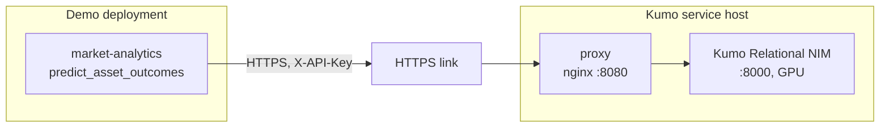

<!--
SPDX-FileCopyrightText: Copyright (c) 2026, NVIDIA CORPORATION & AFFILIATES. All rights reserved.
SPDX-License-Identifier: Apache-2.0
-->

# Kumo service

The prediction tool, `predict_asset_outcomes`, runs on NVIDIA Kumo Relational. The demo stack runs no Kumo
model: the Kumo Relational NIM runs on a GPU host of its own, behind a proxy that checks an API key, and
demo deployments reach it through an HTTPS link. A demo deployment is configured with the link's URL and
the key, and nothing else: `KUMO_RELATIONAL_URL` and `KUMO_API_KEY` ([configuration](configuration.md)).
Any number of deployments can share one service, and the demo host's GPU is left to the market tools.

[`infra/kumo-service/`](../infra/kumo-service/compose.yaml) is the recipe, a Compose project of its own
(`kumo-service`):



| Service | Image (pinned by digest) | Role |
|---|---|---|
| `kumo-relational` | `nvcr.io/nim/nvidia/kumo-relational:1.0.1` | The NIM, on every GPU of the host (`gpus: all`), with a 16 GB shared-memory segment. No host port: the proxy is the only way in |
| `proxy` | `nginxinc/nginx-unprivileged:1.30.5-alpine` | Published on `KUMO_SERVICE_BIND:KUMO_SERVICE_PORT` (`0.0.0.0:8080`). Every route but `/healthz` needs `X-API-Key` equal to the service's key, or answers 401; the key is removed before the request goes on. Request bodies of up to 64 MiB stream to the NIM as they arrive, with 300 s for the NIM to answer. 5 requests a second per client address, in bursts of up to 40, and 16 connections (429 past them), wrong keys included. No version in the `Server` header. The log has the address, method, path, status, sizes and time of each request, never a header or a query string |

The demo's market-analytics server makes the calls, outside the agent's sandbox, so neither the sandbox policy
nor Switchyard names the Kumo host. Each prediction is three requests: the client's two probes
(`GET /v1/health/ready` and `GET /v1/models`) and `POST /v1/predictions`, whose JSON body carries the sampled
graph: about 7 MB for `us-equities` and 9.3 MB for `synthetic-market`, measured with the demo's client. The
Kumo client refuses to send a key over plain HTTP, so the demo needs the link's `https://` URL.

The key lives in the service's `.env` (mode 600, gitignored). Compose hands it to the proxy as a secret file,
from which the proxy writes its key list into the container's `/tmp` at start; the key is never in the image,
in the container's environment, or in a log. `KUMO_SERVICE_PREVIOUS_API_KEY`, when set, is accepted too, for
rotation.

## Sizing

| Resource | Need | Measured on a 40 GB A100 VM |
|---|---|---|
| GPU | One NVIDIA GPU the NIM supports, with 24 GB or more of memory. The NIM has no GPU gate and needs no override on a GPU outside its support matrix, such as the A100 | 0.85 GiB at idle; about 3.5 GiB at peak, after its first predictions (PyTorch's cache) |
| Disk | 100 GB or more: the image, the OS and Docker | The image: about 14 GB to download (5 minutes) and 44 GB on disk |
| CPU | 4 vCPU or more | – |
| Memory | 16 GB or more | 1.8 GiB for the NIM at idle |
| Host | Linux x86_64 (the NIM is amd64 only), Docker Engine 28+ with Compose 2.30+, an NVIDIA driver and the NVIDIA Container Toolkit (`docker info` lists the `nvidia` runtime); for example Ubuntu 22.04 | – |

The NIM turned healthy about 40 s after it started. A prediction took 10.5 to 12.6 s for the return
templates and 0.6 s for a news template, and repeat calls returned identical probabilities. On
`synthetic-market` the events are fictional and planted, and the history before the anchor does not foretell
them: present the probabilities as the model's output, not as a forecast. The NIM logs
`TagsBasedProfileSelector not able to find the profile` and then `ManifestProfileSelector compatible profile
selected`, which is expected: its only model profile (PyTorch, fp32) carries no GPU tag, so it is selected by
hardware filtering on any GPU.

## Set up

On the Kumo host, with this repository (only `infra/kumo-service/` is used; no submodule, no build):

```bash
git clone https://github.com/pastorsj/market-analysis-claw-demo.git
cd market-analysis-claw-demo/infra/kumo-service

# .env from .env.example with a new key, written straight to the file (mode 600): never on a command line
(umask 077 && { grep -v '^KUMO_SERVICE_API_KEY=' .env.example
  printf 'KUMO_SERVICE_API_KEY=%s\n' "$(openssl rand -hex 32)"; } >.env)

docker compose pull     # about 14 GB
docker compose up -d
docker compose ps       # kumo-relational turns healthy about 40 s after it starts
```

The image pulled without an NGC login. If `nvcr.io` denies it, add `NGC_API_KEY=<your key>` to `.env` with
an editor (the NIM then gets it too) and log in with the key piped from the file:

```bash
sed -n 's/^NGC_API_KEY=//p' .env | docker login nvcr.io --username '$oauthtoken' --password-stdin
```

Check it on the host. `kumo_curl` reads the key from `.env` and hands it to curl on stdin:

```bash
kumo_curl() { sed -n 's/^KUMO_SERVICE_API_KEY=\(.*\)/header = "X-API-Key: \1"/p' .env | curl -sS --config - "$@"; }
curl -sS http://127.0.0.1:8080/healthz                                       # the NIM is ready
curl -sS -o /dev/null -w '%{http_code}\n' http://127.0.0.1:8080/v1/models    # 401
kumo_curl http://127.0.0.1:8080/v1/models                                    # lists kumo-relational
```

`docker compose logs -f proxy` shows each request. The services restart on their own (`unless-stopped`),
also after a reboot.

## Expose it through an HTTPS link

Point an HTTPS link at the proxy's port, 8080: for a Brev instance, create one in the Brev console on the
instance's page (**Access**, then share or expose port 8080). The link terminates TLS. It must let requests
through without a sign-in of its own, because the demo's server calls it with nothing but the key: the key is
the gate, on every route but `/healthz`.

A Brev link reaches the instance over its private network interface, not its loopback, so keep
`KUMO_SERVICE_BIND=0.0.0.0`. Docker publishes the port past host firewalls such as ufw, so it also answers on
any other interface that the cloud's firewall lets through; every route but `/healthz` needs the key there too.
For a tunnel that runs on the host itself, set `KUMO_SERVICE_BIND=127.0.0.1` and run `docker compose up -d`.

The rate limit is per client address. Behind a link, every request comes from the link's proxy, so the limit
applies to all clients together; to apply it per client, set `KUMO_SERVICE_REAL_IP_FROM` to the link proxy's
addresses (the first column of the proxy's log) and run `docker compose up -d`. The client address then comes
from `X-Forwarded-For`, trusted from those addresses only.

Check it from anywhere, with the link's URL:

```bash
url=https://<link-host>
curl -sS "$url/healthz"                                                    # the NIM is ready
curl -sS -o /dev/null -w '%{http_code}\n' "$url/v1/models"                 # 401
curl -sS -o /dev/null -w '%{http_code}\n' -H 'X-API-Key: wrong' "$url/v1/models"   # 401
```

and with the key, on the Kumo host (`kumo_curl` above):

```bash
kumo_curl -o /dev/null -w '%{http_code}\n' "$url/v1/models"                # 200
```

## Point a demo deployment at it

In the demo deployment's `.env` (section 3), set the link's URL and the key:

```bash
KUMO_RELATIONAL_URL=https://<link-host>
KUMO_API_KEY=<the service's key>
```

Paste the key with an editor, or copy it over SSH without it touching a command line or the screen:

```bash
# On the demo host, in the repository: replace the KUMO_API_KEY line with the service's key
(umask 077 && { grep -v '^KUMO_API_KEY=' .env
  ssh <kumo-host> "sed -n 's/^KUMO_SERVICE_API_KEY=/KUMO_API_KEY=/p' market-analysis-claw-demo/infra/kumo-service/.env"
} >.env.new) && mv .env.new .env
```

Then:

```bash
./scripts/demo.sh doctor --keys   # "kumo: kumo-relational is listed": the URL and the key work
./scripts/demo.sh up              # market analytics gets the URL and key; the agent image gets the kumo tool
```

`doctor` stops `up` when only one of the two is set, when the URL is not `https://`, or when neither
`analytics` nor `analytics-gpu` runs. With neither set, Kumo stays off: the agent has no prediction tool, and
the questions that declare it (`tools: [kumo]`) are left out of the landing page, the example picker and
`record`. To see the whole path work, ask the Five-Session Outlook example: the run calls
`predict_asset_outcomes` and returns one probability per stock.

**Moving a deployment off the old `kumo` profile.** Earlier versions ran the NIM in the demo stack, under a
`kumo` profile that no longer exists (`doctor` says so). On a host that ran it, remove its container, its
anonymous volumes and its image, about 44 GB:

```bash
docker rm -f -v market-demo-kumo-relational-1
docker image rm nvcr.io/nim/nvidia/kumo-relational:1.0.1
```

Then take `kumo` out of `COMPOSE_PROFILES`, set the two variables as above, and run `doctor --keys` and `up`.

## Rotate the key

The proxy accepts the previous key beside the new one until you drop it, so deployments switch without a
gap. On the Kumo host, in `infra/kumo-service`:

```bash
# 1. A new key; the current one becomes the previous key
(umask 077 && { grep -v -e '^KUMO_SERVICE_API_KEY=' -e '^KUMO_SERVICE_PREVIOUS_API_KEY=' .env
  sed -n 's/^KUMO_SERVICE_API_KEY=/KUMO_SERVICE_PREVIOUS_API_KEY=/p' .env
  printf 'KUMO_SERVICE_API_KEY=%s\n' "$(openssl rand -hex 32)"; } >.env.new) && mv .env.new .env
docker compose up -d --force-recreate proxy   # a secret's new value takes a recreate; the NIM keeps running
```

2. On each demo deployment, set the new `KUMO_API_KEY` as above and run `./scripts/demo.sh restart kumo`, which
   recreates market analytics with it (a plain `up` or `restart` keeps the old key).
3. Back on the Kumo host, drop the old key:

```bash
(umask 077 && { grep -v '^KUMO_SERVICE_PREVIOUS_API_KEY=' .env; echo 'KUMO_SERVICE_PREVIOUS_API_KEY='; } >.env.new) &&
  mv .env.new .env
docker compose up -d --force-recreate proxy
```

If a key leaks, skip the overlap: write the new key without moving the old one to `KUMO_SERVICE_PREVIOUS_API_KEY`,
recreate the proxy, and update the deployments.

## Test

`./scripts/demo.sh test kumo-service` (part of `test all`) runs the proxy, unchanged, in front of a stub NIM on
any Docker host, with no GPU: under a throwaway Compose project with random keys, on a free loopback port. It
checks 401 without a key, with a wrong key and with near misses, 200 with the key and with the previous key, that
the key never reaches the NIM, that a 32 MiB POST arrives whole and a 65 MiB one gets 413, `/healthz` without a
key, the `Server` header, the rate limit, and that no key appears in any log; then it removes what it created.
`./scripts/demo.sh test compose` checks the recipe's Compose file: every image pinned by digest, and only the
proxy published.
